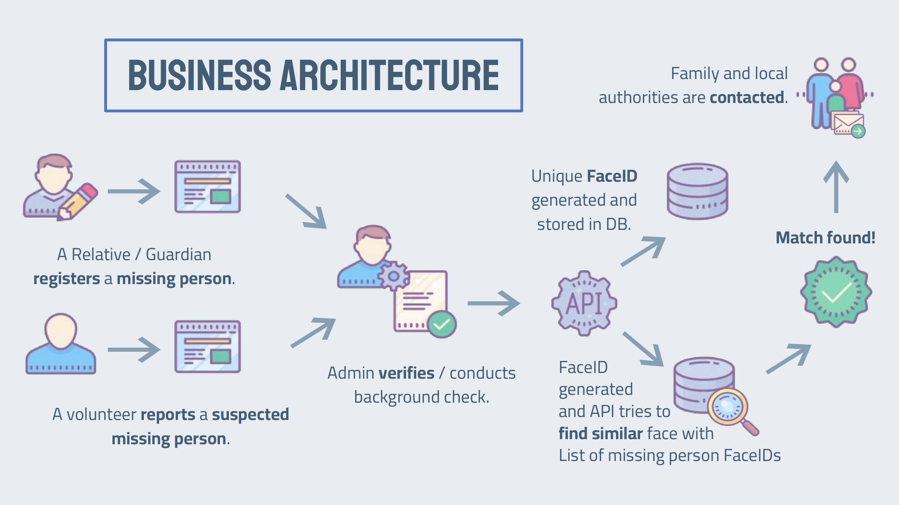
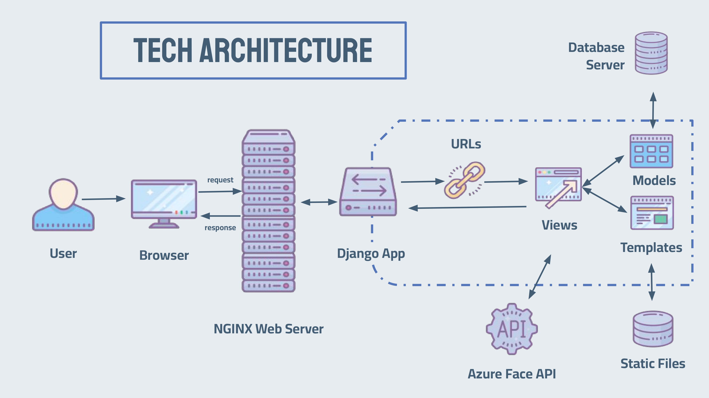
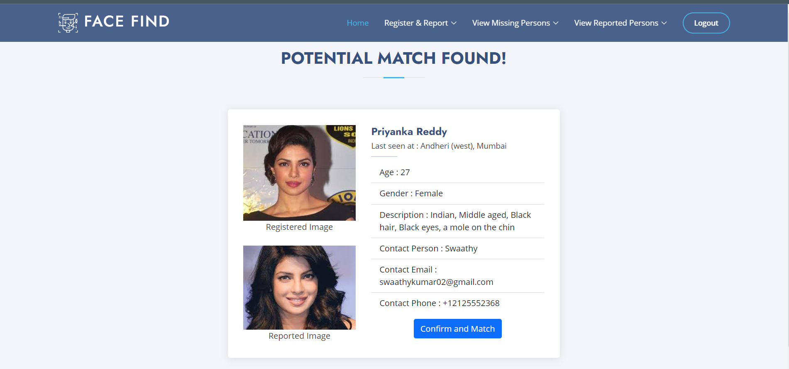
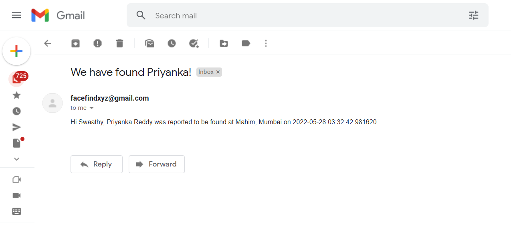
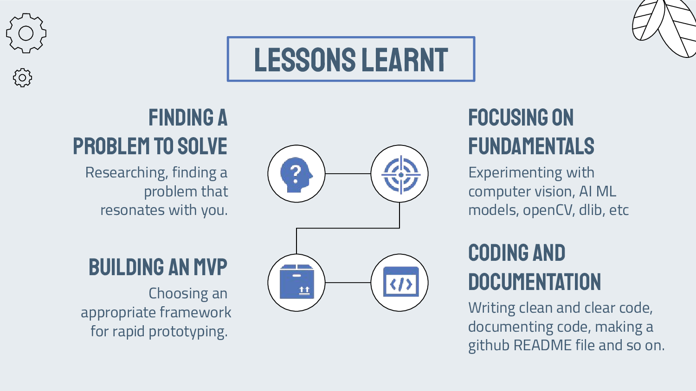

<!-- PROJECT LOGO -->

<br />

<div align="center"><a  href="#top"></a>


  

<h2 align="center">FACE FIND</h2>

<h3 align="center">Submission for Microsoft Engage 2022</h3>

<p align="center">

A Django Web Application to help find missing people using Face Recognition.

  Now deployed on Heroku! Click [here](https://facefindxyz.herokuapp.com/) to check it out!
<br />

[](https://github.com/tinycoder2/FaceFind)
[](https://github.com/tinycoder2/FaceFind)
[](https://github.com/tinycoder2/FaceFind)
[](https://youtu.be/onXOQIu5jCg)

<br />

</div>

  

<!-- TABLE OF CONTENTS -->
<details>
<summary>Table of Contents</summary>
<ol>
<li><a  href="#about-the-project">About The Project</a>
<ul>
<li><a  href="#built-with">Built With</a></li>
</ul>
</li>
<li>
<a  href="#getting-started">Getting Started</a>
<ul>
<li><a  href="#prerequisites">Prerequisites</a></li>
<li><a  href="#getting-api-credentials">Getting API credentials</a></li>
<li><a  href="#setup">Setup</a></li>
</ul>
</li>
<li><a  href="#business-logic">Business Logic</a></li>
<li><a  href="#tech-architecture">Tech Architecture</a></li>
<li><a  href="#features-and-interfaces">Features and Interfaces</a></li>
<li><a  href="#discussions">Discussions</a></li>
<li><a  href="#lessons-learnt">Lessons Learnt</a></li>
<li><a  href="#future-work">Future Work</a></li>
</ol>
</details>

 
<!-- ABOUT THE PROJECT -->
##  About The Project
The thought of a family member, a friend or someone else you care about going missing can be terrifying. This project aims to help find your loved ones using Face Recognition Technology. If someone you know is missing, then,
- Register the missing person with us.
- Once the background check is done and the missing person is verified, we generate a unique Face ID for the missing person using Azure's Face API.
- When volunteers report a suspected missing person, we verify and generate a Face ID the same way. We then use Azure's Find Similar API to identify a potential match with our database of missing person Face IDs.
- If a match is found we will contact you.
<p align="right">(<a  href="#top">back to top</a>)</p>

###  Built With
To achieve the goal of finding missing people, I made use of the following tools and languages,
<p align="left">
<a  href="https://getbootstrap.com"  target="_blank"> </a>
<a  href="https://www.w3schools.com/css/"  target="_blank">  </a>
<a  href="https://developer.mozilla.org/en-US/docs/Web/JavaScript"  target="_blank">  </a>
<a  href="https://www.w3.org/html/"  target="_blank">  </a>
<a  href="https://www.python.org/"  target="_blank">  </a>
<a  href="https://www.djangoproject.com/"  target="_blank">  </a>
<a  href="https://docs.microsoft.com/en-us/azure/cognitive-services/face/"  target="_blank">  </a>
<a  href="https://www.sqlite.org/index.html"  target="_blank">  </a>
<a  href="https://git-scm.com/"  target="_blank">  </a>
<a  href="https://heroku.com"  target="_blank">  </a>
<p align="right">(<a  href="#top">back to top</a>)</p>

<!-- GETTING STARTED -->
##  Getting Started
###  Prerequisites
Firstly you have to make sure you have python installed. If you don't have python, you can get it [here](https://www.python.org/downloads/).
* Use this command to check if python is installed,
```sh
python --version
```
###  Getting API credentials
To access Azure Cognitive Services REST API for Face Analysis, you will need,
- An Azure account (you can create your account for free [here](https://azure.microsoft.com/en-au/free/))
- A Computer Vision Resource in your Azure account

To create a Computer Vision Resource, you can navigate through the portal, create a new resource and go under the class of “AI+Machine Learning”. Then select the Face Cognitive Service and set the required information.

Under the Resource Management tab you will find “Keys and Endpoint”. From this section, copy one of the two Keys and the Endpoint and paste it somewhere safe. We will be using these in the `config.json` file.

For detailed instructions click [here.](https://medium.com/microsoftazure/azure-cognitive-services-rest-api-for-computer-vision-cf782e975837)

###  Setup

_To get a local copy of the project and run it, follow these steps._

1. Create a folder in which you want set up the project. Go into that folder and check if python is installed.

  ```sh
  mkdir myFolder
  cd myFolder
  python --version

  ```

2. Clone the repository:

  ```sh
  git clone https://github.com/tinycoder2/FaceFind.git
  ```

3. Create a virtual environment to install dependencies in and activate it:

  ```sh
  python -m venv myEnv
  cd myEnv
  .\Scripts\activate
  cd ..
  ```

4. Then install the dependencies:

  ```sh
  cd FaceFind
  pip install -r requirements.txt
  ```

  

5. Enter your API KEY, ENDPOINT that we got from <a  href="#credentials">Getting API credentials</a>, EMAIL ID and EMAIL PASSWORD in `config.json`

  ```json
  {
    "KEY": "Your Azure API KEY",
    "ENDPOINT": "Your Azure Endpoint",
    "EMAIL-ID": "Your Email ID from which the app will contact is missing person is found",
    "EMAIL-PASSWORD": "Password for said Email ID"
  }
  ```

To allow the app access your email account, go to [google account setting](https://myaccount.google.com/intro/security?hl=en) , security tab and ensure that you have *Less secure app access* turned *on.*

6. Go to `msengage\settings.py` and change line number 18 as,

  ```py
  # Change to False if cloning and running on local host
  IS_DEPLOYED_ON_HEROKU =  False
  ```

7. Apply migrations:

  ```sh
  python manage.py migrate
  ```

8. Create admin account :

  ```sh
  python manage.py createsuperuser
  ```

Follow the promt and enter the username, preferably *"admin"*, desired email and password. Make note of the username and password as you will have to use these credentials to login.

9. Run server:

  ```sh
  python manage.py runserver
  ```

The app is now running at `http://127.0.0.1:8000/`

<p align="right">(<a  href="#top">back to top</a>)</p>

  
  
  

<!-- ARCHITECTURE DIAGRAMS -->

##  Business Logic



<p align="right">(<a  href="#top">back to top</a>)</p>

  

<!-- ARCHITECTURE DIAGRAMS -->

##  Tech Architecture



<p align="right">(<a  href="#top">back to top</a>)</p>

  

<!-- Features and Interfaces -->

##  Features and Interfaces
### Home Screen
- Landing page displaying hero section, about section, technology used and FAQ section.

https://user-images.githubusercontent.com/72341529/170797626-e4a6fc58-5665-435a-99a0-cff8b7e84a64.mp4

### Registering a Missing Person

https://user-images.githubusercontent.com/72341529/170797691-54077207-c774-48f9-bcab-6db4be10e198.mp4


### Reporting a Suspected Missing Person

https://user-images.githubusercontent.com/72341529/170797730-6b5c78b9-ab0f-4bf3-8237-7c6a5d64820c.mp4

### Admin Login and Views
- Logging in as the admin and displaying site from admin POV.

https://user-images.githubusercontent.com/72341529/170797751-4897c355-0f34-4d25-88ca-16e45019ddee.mp4

### Missing People Views
- Viewing all missing people, ones that need to be approved, approving a missing person (background check), viewing missing people with status as Leads, status as Found,  Deleting a missing person, Editing the details of a missing person.

https://user-images.githubusercontent.com/72341529/170797773-ac2bd097-2e3b-44dc-94b0-7c47003ecbcb.mp4

### Reported Person Views
- Viewing all reported people, ones that need to be approved, approving a reported person (checking validity of report), viewing details of potential match, confirming the match, status of missing person changing from Leads to Found. 


https://user-images.githubusercontent.com/72341529/170797791-7d0093a4-8dec-4f70-ba61-35aafb594007.mp4


### Details of Match Found


### Email Received


  

<p align="right">(<a  href="#top">back to top</a>)</p>

  

<!-- DISCUSSIONS -->

##  Discussions

- Face Detection

  - To detect the face in the image the person uploads, we use the [Detect With Stream API](https://docs.microsoft.com/en-us/rest/api/faceapi/face/detect-with-stream).

  - In `people\views.py` we have a function `generate_face_id` that uses the Detect With Stream API to get the faceID, which is an identifier of the face feature and will be used in [Face - Find Similar](https://docs.microsoft.com/en-us/rest/api/faceapi/face/findsimilar).

  ```py

  # function to generate face_id using Azure Face API

  def  generate_face_id(image_path):
    face_client =  FaceClient(config['ENDPOINT'], CognitiveServicesCredentials(config['KEY']))
    response_detected_face = face_client.face.detect_with_stream(
    image=open(image_path, 'rb'),
    detection_model='detection_03',
    recognition_model='recognition_04',
  )
  return response_detected_face

  ```

- Face Recognition

  - Given query face's faceID, to search the similar-looking faces from a `faceID array`, which is an array of faceIDs generated from [Detect With Stream API](https://docs.microsoft.com/en-us/rest/api/faceapi/face/detect-with-stream), we use the [Face - Find Similar API](https://docs.microsoft.com/en-us/rest/api/faceapi/face/findsimilar).

  - In `people\views.py` we have a function `find_match` that uses this API to find a match for the reported person from the list of missing people faceIDs.

  ```py
  # function to find a match for the reported person from the list of missing people using Azure Face API
  def  find_match(reported_face_id, missing_face_ids):
    face_client =  FaceClient(config['ENDPOINT'], CognitiveServicesCredentials(config['KEY']))
    matched_faces = face_client.face.find_similar(
    face_id=reported_face_id,
    face_ids=missing_face_id
  )
  return matched_faces
  ```

- Given the timeframe for this project and the fact that I was using a free account with limited number of API calls, I have built my **MVP** with these two APIs.

- In the future I plan to make use of a `faceListId` instead of the `faceID array` for the [Face - Find Similar API](https://docs.microsoft.com/en-us/rest/api/faceapi/face/findsimilar).

- The major difference between these two is that `faceID array` contains the faces created by [Face - Detect With Url](https://docs.microsoft.com/en-us/rest/api/faceapi/face/detectwithurl) or [Face - Detect With Stream](https://docs.microsoft.com/en-us/rest/api/faceapi/face/detectwithstream), which will expire at the time specified by faceIdTimeToLive after creation, which is about 86400 seconds (24 hours) by default. A `faceListId` is created by [FaceList - Create](https://docs.microsoft.com/en-us/rest/api/faceapi/facelist/create) containing persistedFaceIds that will not expire.

- Furthermore, one could also use [PersonGroup](https://docs.microsoft.com/en-us/rest/api/faceapi/persongroup) / [LargePersonGroup](https://docs.microsoft.com/en-us/rest/api/faceapi/largepersongroup) and [Face - Identify](https://docs.microsoft.com/en-us/rest/api/faceapi/face/identify) when the face number is large, the [LargeFaceList](https://docs.microsoft.com/en-us/rest/api/faceapi/largefacelist) can support up to 1,000,000 faces.


<p align="right">(<a  href="#top">back to top</a>)</p>

  <!--LESSONS LEARNT -->
  ##  Lessons Learnt



<p align="right">(<a  href="#top">back to top</a>)</p>

<!--FUTURE WORK -->

##  Future Work

- Future plans include,

- SMS verification for registering a missing person

- Geo location from IP address while reporting suspected missing person.

- Using Azure's [PersonGroup](https://docs.microsoft.com/en-us/rest/api/faceapi/persongroup) / [LargePersonGroup](https://docs.microsoft.com/en-us/rest/api/faceapi/largepersongroup) and [Face - Identify](https://docs.microsoft.com/en-us/rest/api/faceapi/face/identify) for face detection and identification.

- Sanitizing traffic to prevent API throttling.

<p align="right">(<a  href="#top">back to top</a>)</p>

  
  
  
